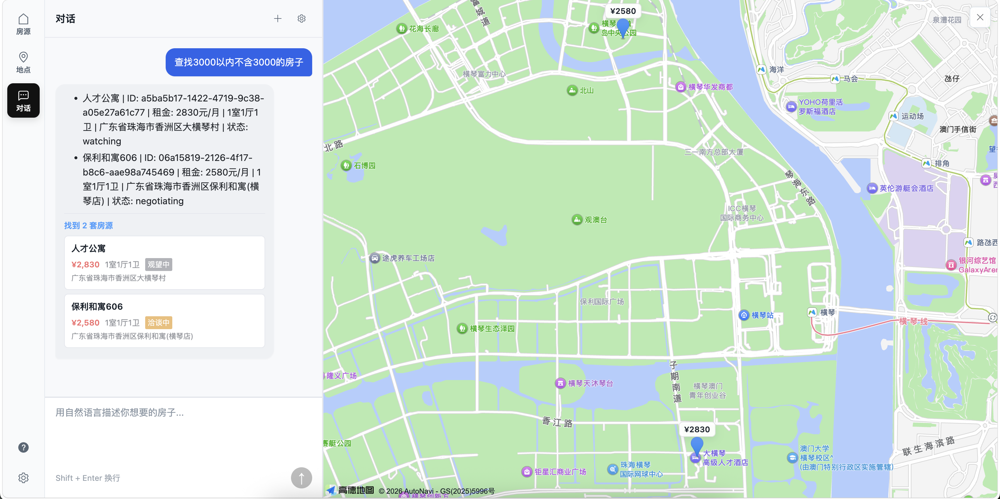
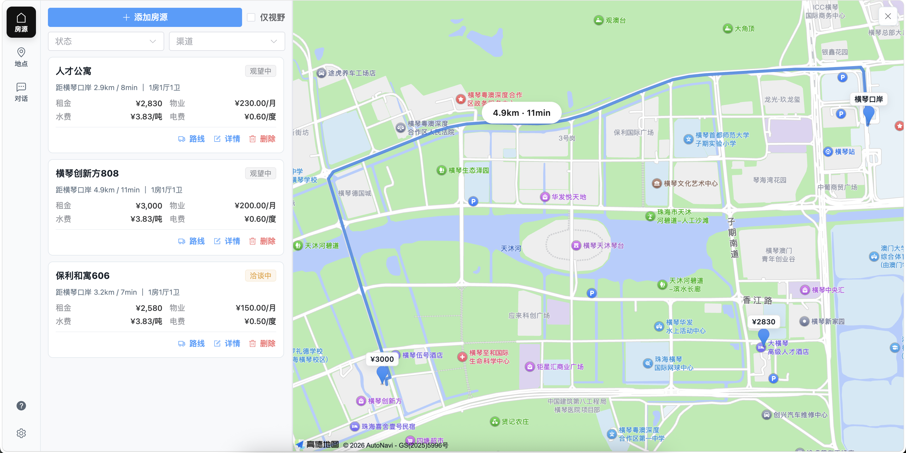

# FindMyHouse

看房多了，记性不够用。FindMyHouse 帮你把各个渠道收集的房源汇总起来，在地图上直观比较位置、通勤与费用；并提供对话式 AI 助手，用自然语言完成查询、录入和管理。




## 功能概览

- 房源管理：统一录入/编辑来自不同渠道的房源信息，包含租金、户型、费用明细、联系方式与状态流转
- 地点管理：维护公司/学校等关键地点，支持设置一个“焦点地点”作为通勤终点
- 地图展示：房源与地点统一标注，支持地图拾取坐标
- 通勤计算：房源到焦点地点的驾车距离/时间与路线展示，服务端缓存路线结果
- AI 找房助手：自然语言搜索/查看/新增/更新/删除房源；支持会话历史管理

## 技术栈

- 前端：Vue 3 + Vite + Pinia + Element Plus
- 后端：Fastify + Zod + TypeScript
- 数据：SQLite（better-sqlite3，本地文件）
- AI：LangChain + LangGraph（OpenAI 协议兼容服务）
- 地图：高德地图 JS API + Web Service API

## 快速开始（本地开发）

### 环境要求

- Node.js >= 20
- npm >= 10

### 安装依赖

```bash
npm install
```

### 启动开发环境

```bash
npm run dev
```

启动后访问：

- Web： http://localhost:5173
- API： http://localhost:3001/api/health

### 首次使用必做

1. 打开 Web 后进入欢迎页/设置页
2. 配置并保存：
   - 高德：Web Service Key、JS API Key（以及可选的 Security JS Code）
   - OpenAI 兼容服务：Base URL、API Key、Model、Temperature
3. 新增地点并设置一个焦点地点（通勤计算以它为终点）

## 配置说明

### 业务配置（通过页面保存）

系统的 OpenAI/高德 Key 并不是从 `.env` 读取，而是通过页面保存后写入本地 SQLite（`app_config` 表）。

- 高德
  - Web Service Key：用于服务端的地理编码、路线与距离计算
  - JS API Key：用于前端加载地图
  - Security JS Code：如你在高德控制台启用了安全密钥，需要填写
- OpenAI 兼容服务
  - Base URL：例如 DeepSeek、OpenAI、或自建兼容网关
  - API Key / Model / Temperature

### 运行参数（环境变量）

后端不自动加载根目录 `.env`；如需修改后端监听端口或数据库路径，请通过环境变量传入。

- `HOST`：默认 `0.0.0.0`
- `PORT`：默认 `3001`
- `DATABASE_URL`：SQLite 文件路径；不设置则默认为 `backend/data/find-my-house.sqlite`

前端会读取根目录 `.env` 用于设置 Vite 端口与开发代理（例如 `VITE_PORT`、以及代理目标端口 `PORT`）。

## 数据存储与备份

- 默认数据库文件：`backend/data/find-my-house.sqlite`
- 备份方式：停止服务后复制该 sqlite 文件即可（同时包含房源、地点、路线缓存、对话会话与配置）

## 常用命令

```bash
# 本地开发（前后端一起启动）
npm run dev

# 构建（后端 tsc + 前端 vite build）
npm run build

# 类型检查
npm run typecheck

# 生产启动（仅后端 API）
npm run start
```

## 生产部署

当前仓库的生产运行形态是：后端单独提供 API；前端构建产物需要用任意静态资源服务器托管（推荐 Nginx），并反向代理 `/api` 到后端。

### 1) 构建

```bash
npm install
npm run build
```

构建后产物：

- 后端：`backend/dist/`
- 前端：`frontend/dist/`

### 2) 启动后端

```bash
HOST=0.0.0.0 PORT=3001 DATABASE_URL=/path/to/find-my-house.sqlite npm run start
```

### 3) 托管前端并反代 /api（Nginx 示例）

将 `frontend/dist` 复制到服务器目录（例如 `/var/www/find-my-house`），并使用如下配置：

```nginx
server {
  listen 80;
  server_name your-domain.com;

  root /var/www/find-my-house;
  index index.html;

  location / {
    try_files $uri $uri/ /index.html;
  }

  location /api/ {
    proxy_pass http://127.0.0.1:3001;
    proxy_set_header Host $host;
    proxy_set_header X-Real-IP $remote_addr;
    proxy_set_header X-Forwarded-For $proxy_add_x_forwarded_for;
    proxy_set_header X-Forwarded-Proto $scheme;
  }
}
```

### 4) 高德 Key 的域名白名单

如果在公网域名下使用前端地图，需要在高德控制台为 JS API Key 配置正确的域名白名单；否则地图可能加载失败。

## 接口速览

- `GET /api/health`：健康检查
- `GET/POST /api/config`：读取/保存业务配置（OpenAI/高德）
- `GET/POST/PATCH/DELETE /api/houses`：房源 CRUD + 筛选
- `GET/POST/PATCH/DELETE /api/locations`：地点 CRUD + 设置焦点地点
- `POST /api/maps/geocode`：地址解析
- `POST /api/maps/driving-distance`：驾车距离/时间
- `POST /api/maps/driving-route`：驾车路线（带服务端缓存）
- `POST /api/chat`：AI 对话
- `GET/POST/PATCH/DELETE /api/chat/sessions*`：会话管理

## 常见问题

- 地图加载失败：检查 JS API Key、Security JS Code 与域名白名单；同时确认后端已保存 Web Service Key
- AI 助手不可用：检查是否在设置页保存了 OpenAI Base URL/API Key/Model
- 修改端口不生效：后端不读取 `.env`，请使用环境变量传入 `PORT/HOST/DATABASE_URL`
