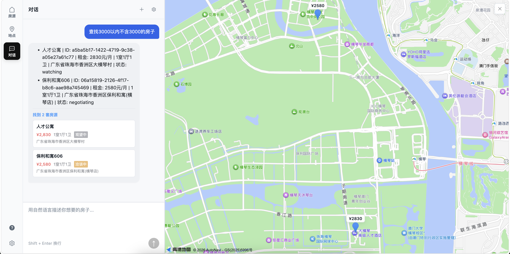
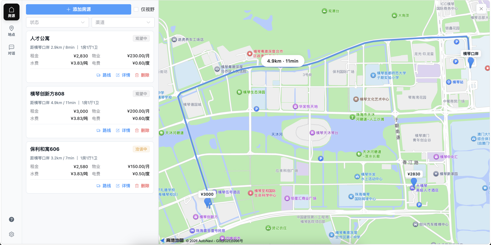

# FindMyHouse

把散落在中介、小红书、豆瓣、贝壳、微信群里的房源，收进一个能看地图、算通勤、做对比、还能直接对话的找房工作台。

FindMyHouse 不是一个房源平台，而是给「正在认真找房的人」用的个人决策工具：把候选房源统一记录下来，用地图看位置，用通勤路线判断生活半径，用费用和状态筛掉不合适的选择，最后让 AI 助手帮你用自然语言查、录、改、管。




## 它解决什么问题

找房最烦的不是「没有房源」，而是信息太散：

- 今天在群里看到一套，明天在平台收藏一套，后天中介又发来三套
- 租金、押金、物业、水电、联系方式、看房状态都混在聊天记录里
- 地图上看着近，实际通勤可能很绕
- 想比较几套房，只能反复翻截图和表格

FindMyHouse 把这些信息变成一个可管理的本地数据库。你可以把它当作「找房版 CRM」：每套房都有状态、费用、联系人、地图坐标和路线数据，所有判断都围绕你自己的焦点地点展开，比如公司、学校或家人住所。

## 核心能力

- **房源收纳**：记录房源名称、地址、租金、户型、来源渠道、状态、联系人、押金、物业费、自定义费用等信息
- **地图决策**：房源和关键地点统一显示在高德地图上，支持地图拾取坐标、视野内筛选和房源定位
- **通勤计算**：自动计算房源到焦点地点的驾车距离、时间和路线，后端缓存结果，减少重复请求
- **多房源对比**：选择 2-4 套房源横向比较，快速看出租金、总成本、户型、状态和通勤差异
- **数据看板**：按租金、来源、状态、通勤等维度汇总候选房源，辅助做最终选择
- **AI 找房助手**：用自然语言搜索、查看、新增、更新、删除房源，也能把搜索结果同步展示到地图
- **本地优先**：数据默认存在本机 SQLite 文件里，适合个人长期维护和备份

## 技术栈

- 前端：Vue 3 + Vite + Pinia + Element Plus + ECharts
- 后端：Fastify + Zod + TypeScript
- 数据：SQLite + better-sqlite3
- AI：LangChain + LangGraph，支持 OpenAI 协议兼容服务
- 地图：高德地图 JS API + Web Service API

## 快速部署

让 AI Agent 帮你完成从零到一的完整部署：

```text
帮我部署 FindMyHouse：`https://github.com/wilson-lyc/FindMyHouse/blob/main/Install.md`
```

## 本地运行

### 环境要求

- Node.js >= 20
- npm >= 10

### 安装依赖

```bash
npm install
```

### 启动开发环境

```bash
npm run dev
```

启动后访问：

- Web：http://localhost:5173
- API：http://localhost:3001/api/health

## 首次配置

第一次打开 Web 页面后，先完成三件事：

1. 进入设置页，保存高德地图配置：
   - Web Service Key：给后端做地址解析、路线和距离计算
   - JS API Key：给前端加载地图
   - Security JS Code：如果高德控制台启用了安全密钥，则需要填写
2. 保存 OpenAI 兼容服务配置：
   - Base URL
   - API Key
   - Model
   - Temperature
3. 新增一个关键地点，并设置为焦点地点。通勤计算会以这个地点作为终点。

这些业务配置不会从 `.env` 读取，而是通过页面保存到本地 SQLite 的 `app_config` 表。

## 常用命令

```bash
# 前后端一起启动
npm run dev

# 构建后端和前端
npm run build

# 类型检查
npm run typecheck

# 生产启动后端 API
npm run start
```

## 数据与配置

默认数据库文件：

```text
backend/data/find-my-house.sqlite
```

这个 SQLite 文件包含房源、地点、路线缓存、AI 会话和页面配置。需要备份时，停止服务后复制这个文件即可。

后端运行参数通过环境变量传入：

- `HOST`：默认 `0.0.0.0`
- `PORT`：默认 `3001`
- `DATABASE_URL`：SQLite 文件路径；不设置时使用 `backend/data/find-my-house.sqlite`

前端开发环境会读取根目录 `.env`，主要用于设置 Vite 端口和开发代理，例如 `VITE_PORT` 以及代理目标端口 `PORT`。

## 生产部署

当前生产形态是：后端单独提供 API，前端构建产物交给 Nginx 或其他静态资源服务托管，并把 `/api` 反向代理到后端。

### 1. 构建

```bash
npm install
npm run build
```

构建产物：

- 后端：`backend/dist/`
- 前端：`frontend/dist/`

### 2. 启动后端

```bash
HOST=0.0.0.0 PORT=3001 DATABASE_URL=/path/to/find-my-house.sqlite npm run start
```

### 3. 托管前端并反代 API

Nginx 示例：

```nginx
server {
  listen 80;
  server_name your-domain.com;

  root /var/www/find-my-house;
  index index.html;

  location / {
    try_files $uri $uri/ /index.html;
  }

  location /api/ {
    proxy_pass http://127.0.0.1:3001;
    proxy_set_header Host $host;
    proxy_set_header X-Real-IP $remote_addr;
    proxy_set_header X-Forwarded-For $proxy_add_x_forwarded_for;
    proxy_set_header X-Forwarded-Proto $scheme;
  }
}
```

如果部署到公网域名，需要在高德控制台给 JS API Key 配好域名白名单，否则地图可能无法加载。

## API 速览

- `GET /api/health`：健康检查
- `GET /api/config`、`POST /api/config`：读取/保存高德和 AI 配置
- `GET /api/houses`、`POST /api/houses`、`PATCH /api/houses/:id`、`DELETE /api/houses/:id`：房源管理
- `GET /api/locations`、`POST /api/locations`、`PATCH /api/locations/:id`、`DELETE /api/locations/:id`：地点管理
- `POST /api/maps/geocode`：地址解析
- `POST /api/maps/driving-distance`：驾车距离和时间
- `POST /api/maps/driving-route`：驾车路线，带服务端缓存
- `POST /api/chat`：AI 对话
- `GET /api/chat/sessions`、`POST /api/chat/sessions`、`PATCH /api/chat/sessions/:id`、`DELETE /api/chat/sessions/:id`：会话管理

## 常见问题

**地图加载失败**

检查 JS API Key、Security JS Code、域名白名单，并确认后端已保存 Web Service Key。

**AI 助手不可用**

检查设置页里的 Base URL、API Key 和 Model 是否已保存，且服务支持 OpenAI 协议。

**通勤路线没有结果**

确认房源和焦点地点都有经纬度；如果是新录入的文本地址，先完成地址解析或手动在地图上取点。

**修改端口不生效**

后端不会自动读取根目录 `.env`。需要修改后端端口时，请通过 `PORT`、`HOST`、`DATABASE_URL` 环境变量传入。
