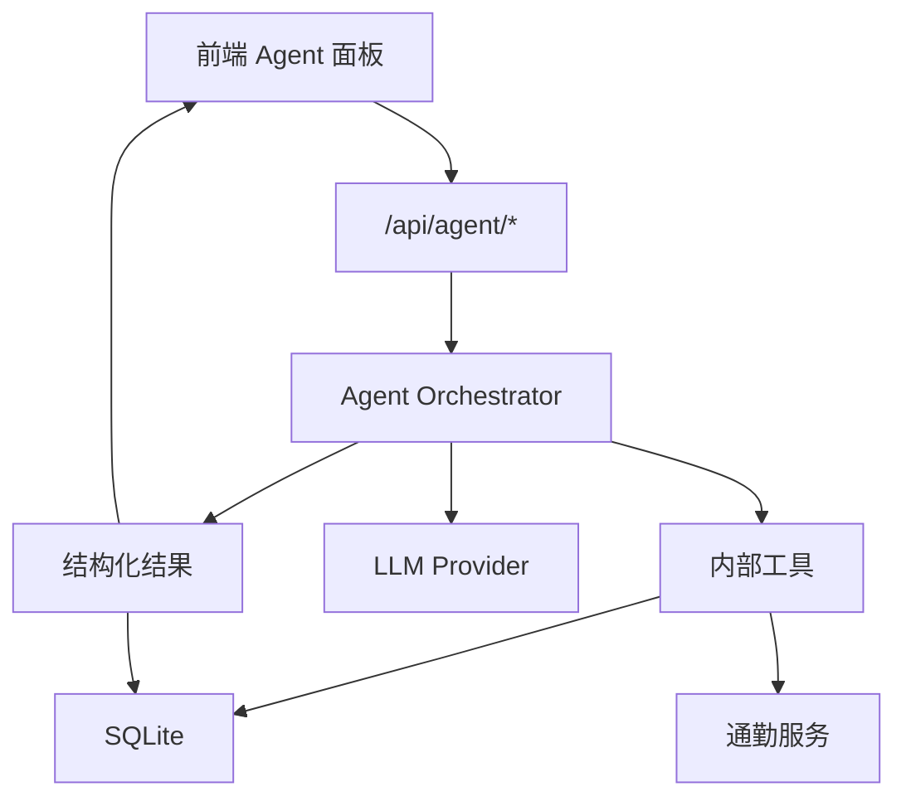

# Agent 设计方案

## Agent 定位

FindMyHouse 的 Agent 不是替用户做不可解释的自动决策，而是作为“租房分析助理”帮助用户更快理解数据、发现风险和形成可解释的选择依据。

Agent 的核心价值：

- 把分散字段和备注总结为清晰结论。
- 根据用户偏好解释推荐排序。
- 发现可能被忽略的风险。
- 生成看房前的问题清单。
- 在用户反馈后持续修正偏好理解。

## Agent 能力边界

Agent 可以：

- 阅读用户授权的房源数据。
- 调用内部工具查询房源、通勤、标签、看房记录和偏好配置。
- 生成结构化推荐、对比报告和风险提示。
- 解释推荐依据。

Agent 不应该：

- 自动联系房东、中介或第三方。
- 自动提交申请或支付费用。
- 编造缺失字段。
- 在没有地图或通勤数据的情况下把猜测说成事实。
- 给出法律、合同或金融方面的绝对结论。

## 后端 Agent Service

Agent Service 建议由后端封装，前端只发送用户意图和上下文 ID。



## 内部工具设计

Agent 可使用的内部工具：

- `listHouses(filters)`：查询房源列表。
- `getHouseDetail(houseId)`：获取单个房源详情。
- `getCommuteResults(houseId)`：获取通勤结果。
- `getUserPreference(preferenceId)`：读取用户偏好。
- `getViewingNotes(houseId)`：读取看房记录。
- `calculateRecommendationScore(houseId, preferenceId)`：计算基础推荐分。
- `saveAgentAnalysis(payload)`：保存分析结果。

这些工具应返回结构化 JSON，减少 LLM 对自由文本的依赖。

## 推荐逻辑

推荐应采用“规则评分 + Agent 解释”的组合，而不是完全依赖 LLM。

基础评分维度：

- 租金匹配度
- 通勤匹配度
- 面积和户型匹配度
- 地点权重匹配度
- 标签偏好匹配度
- 风险扣分
- 看房反馈加权

示例权重：

| 维度 | 默认权重 |
| --- | --- |
| 通勤 | 35% |
| 租金 | 25% |
| 面积/户型 | 15% |
| 生活便利性 | 10% |
| 用户标签偏好 | 10% |
| 风险因素 | 5% |

Agent 负责解释：

- 为什么这套房排名靠前。
- 它适合哪些偏好。
- 最大的不确定性是什么。
- 用户下一步应该确认什么。

## 输出格式

单房源分析建议输出：

```json
{
  "summary": "整体评价",
  "score": 82,
  "pros": ["通勤时间短", "租金在预算内"],
  "cons": ["面积偏小", "缺少押金信息"],
  "risks": ["合同费用结构需要确认"],
  "next_questions": ["是否可以提供押金和中介费明细？"],
  "recommendation": "shortlist",
  "explanation": "推荐原因说明"
}
```

多房源对比建议输出：

```json
{
  "best_overall_house_id": "house-id",
  "ranking": [
    {
      "house_id": "house-id",
      "rank": 1,
      "reason": "通勤和预算最均衡"
    }
  ],
  "tradeoffs": ["A 通勤更好，B 面积更大"],
  "decision_advice": "建议优先预约 A，同时向 B 确认费用细节"
}
```

## Prompt 策略

系统提示词应强调：

- 只基于提供的数据分析。
- 缺失信息必须明确标注。
- 推荐必须可解释。
- 风险提示要谨慎，避免夸大。
- 输出必须符合 JSON Schema。

用户提示词可以由后端模板生成，例如：

- “请根据我的预算、通勤要求和偏好，对这些房源排序。”
- “请帮我比较这三套房源。”
- “请给这套房生成看房问题清单。”

## 安全与隐私

- API Key 存放在后端环境变量中，不进入前端代码。
- Agent 请求前应只传必要字段。
- 用户联系方式、精确住址等敏感字段可以按场景脱敏。
- Agent 输出应保存输入快照，方便追溯当时依据。
- 用户应能删除 Agent 历史分析。

## MVP Agent 范围

第一阶段只做三个能力：

- 单房源摘要与风险提示。
- 多房源推荐排序解释。
- 看房问题清单。

自动导入、网页解析、多轮记忆和主动提醒放到后续阶段。

