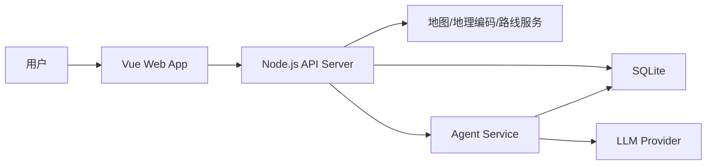

# 系统架构设计

## 总体架构

FindMyHouse 采用前后端分离架构：

- 前端使用 Vue 3 构建交互界面，负责房源列表、地图、筛选、对比和 Agent 对话体验。
- 后端使用 Node.js 提供 REST 或 RPC API，负责数据读写、地理编码、通勤计算、Agent 编排和外部服务调用。
- SQLite 作为本地或单机部署数据库，保存房源、地点、偏好、推荐结果和操作日志。
- 地图与路线能力通过第三方地图服务接入，后端统一封装，避免前端直接承载敏感 API Key。
- Agent Service 位于后端，读取数据库中的结构化数据，调用 LLM 并返回可解释分析结果。

## 前端架构

建议使用：

- Vue 3 + TypeScript + Vite
- Pinia 管理全局状态
- Vue Router 管理页面路由
- 地图组件独立封装，避免业务页面直接耦合地图 SDK
- UI 初期可选 Naive UI、Element Plus 或自建轻量组件

推荐页面结构：

- Dashboard：总览、最近房源、推荐摘要。
- Houses：房源列表、筛选、排序、批量操作。
- Map：地图模式，展示房源点位、工作地点、路线。
- Compare：多房源对比表。
- Agent：对话式分析、推荐解释、风险提示。
- Settings：地点、偏好、地图服务、Agent 配置。

## 后端架构

建议使用 Node.js + TypeScript，框架可在以下二者中选择：

- Fastify：性能好、插件生态清晰、Schema 支持强，推荐。
- Express：上手简单、生态成熟。

后端服务分层：

- API Layer：处理 HTTP 请求、参数校验、鉴权预留。
- Service Layer：房源、地点、通勤、推荐、Agent 等业务逻辑。
- Repository Layer：SQLite 数据访问。
- Integration Layer：地图服务、LLM Provider、网页解析等外部能力。

## 数据库架构

SQLite 适合 MVP 阶段，理由：

- 部署简单，无需独立数据库服务。
- 本地个人数据管理友好。
- 对早期数据规模足够。
- 未来可通过 Repository 抽象迁移到 PostgreSQL。

建议从一开始使用迁移工具管理 schema，例如：

- Prisma Migrate
- Drizzle Kit
- Knex migration

## API 设计风格

MVP 推荐 REST API：

- `GET /api/houses`
- `POST /api/houses`
- `GET /api/houses/:id`
- `PATCH /api/houses/:id`
- `DELETE /api/houses/:id`
- `POST /api/houses/:id/geocode`
- `POST /api/commutes/calculate`
- `POST /api/agent/analyze`
- `POST /api/agent/recommend`

后续如果前后端高度耦合，可以考虑 tRPC，获得端到端类型安全。

## 外部服务封装

地图与路线能力应由后端封装：

- 地理编码：地址转经纬度。
- 逆地理编码：经纬度转可读地址。
- 路线规划：公交、驾车、步行、骑行。
- POI 搜索：超市、地铁站、公园、医院、学校等。

前端只关心标准化后的结果：

- 坐标
- 距离
- 预计时间
- 路线摘要
- 换乘次数
- 通勤成本

## 部署形态

MVP 可采用单机部署：

- Vite 构建静态资源。
- Node.js 同时提供 API 和静态文件服务。
- SQLite 文件保存在服务器本地。

后续可演进为：

- 前端部署到 Vercel、Netlify 或静态服务器。
- 后端部署到 Fly.io、Render、Railway 或自有 VPS。
- 数据库从 SQLite 迁移到 PostgreSQL。

