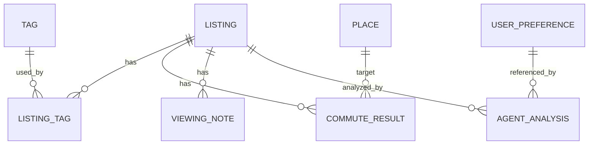

# 数据模型设计

## 设计目标

数据模型应支持三个核心方向：

- 房源信息结构化。
- 地理位置与通勤结果可复用。
- Agent 分析结果可追踪、可解释、可更新。

## 核心实体

## 表结构建议

### houses

保存房源核心信息。

| 字段 | 类型 | 说明 |
| --- | --- | --- |
| id | text | 主键，UUID |
| title | text | 房源标题 |
| source | text | 来源平台 |
| source_url | text | 原始链接 |
| address | text | 地址 |
| latitude | real | 纬度 |
| longitude | real | 经度 |
| rent_price | integer | 月租金 |
| deposit_amount | integer | 押金 |
| agency_fee | integer | 中介费 |
| area_sqm | real | 面积 |
| layout | text | 户型 |
| floor | text | 楼层 |
| orientation | text | 朝向 |
| available_date | text | 可入住日期 |
| status | text | 房源状态 |
| notes | text | 用户备注 |
| created_at | text | 创建时间 |
| updated_at | text | 更新时间 |

### places

保存用户关心的地点。

| 字段 | 类型 | 说明 |
| --- | --- | --- |
| id | text | 主键，UUID |
| name | text | 地点名称 |
| type | text | work、school、home、custom |
| address | text | 地址 |
| latitude | real | 纬度 |
| longitude | real | 经度 |
| weight | real | 推荐权重 |
| created_at | text | 创建时间 |
| updated_at | text | 更新时间 |

### commute_results

保存房源到关键地点的通勤计算结果，避免重复请求地图 API。

| 字段 | 类型 | 说明 |
| --- | --- | --- |
| id | text | 主键，UUID |
| house_id | text | 房源 ID |
| place_id | text | 地点 ID |
| mode | text | walking、cycling、transit、driving |
| distance_meters | integer | 距离 |
| duration_minutes | integer | 预计时间 |
| transfer_count | integer | 换乘次数 |
| walking_meters | integer | 步行距离 |
| cost_estimate | real | 预估费用 |
| route_summary | text | 路线摘要 |
| provider | text | 地图服务商 |
| calculated_at | text | 计算时间 |

### tags

保存标签字典。

| 字段 | 类型 | 说明 |
| --- | --- | --- |
| id | text | 主键，UUID |
| name | text | 标签名 |
| category | text | traffic、cost、comfort、risk、custom |
| color | text | 展示颜色 |

### house_tags

保存房源与标签的多对多关系。

| 字段 | 类型 | 说明 |
| --- | --- | --- |
| house_id | text | 房源 ID |
| tag_id | text | 标签 ID |

### viewing_notes

保存看房记录。

| 字段 | 类型 | 说明 |
| --- | --- | --- |
| id | text | 主键，UUID |
| house_id | text | 房源 ID |
| visited_at | text | 看房时间 |
| rating | integer | 主观评分 |
| content | text | 记录内容 |
| pros | text | 优点 |
| cons | text | 缺点 |
| follow_up_questions | text | 待确认问题 |
| created_at | text | 创建时间 |

### user_preferences

保存用户偏好。

| 字段 | 类型 | 说明 |
| --- | --- | --- |
| id | text | 主键，UUID |
| name | text | 偏好配置名称 |
| max_rent | integer | 预算上限 |
| ideal_rent | integer | 理想租金 |
| max_commute_minutes | integer | 通勤上限 |
| min_area_sqm | real | 最小面积 |
| preferred_tags | text | 偏好标签 JSON |
| rejected_tags | text | 排除标签 JSON |
| weights_json | text | 权重配置 JSON |
| created_at | text | 创建时间 |
| updated_at | text | 更新时间 |

### agent_analyses

保存 Agent 分析结果。

| 字段 | 类型 | 说明 |
| --- | --- | --- |
| id | text | 主键，UUID |
| house_id | text | 可为空，针对单个房源时填写 |
| preference_id | text | 使用的偏好配置 |
| analysis_type | text | summary、risk、recommendation、comparison |
| input_snapshot_json | text | 输入数据快照 |
| output_json | text | 结构化输出 |
| explanation | text | 可读解释 |
| model | text | 使用模型 |
| created_at | text | 创建时间 |

## 状态枚举建议

房源状态：

- `new`
- `shortlisted`
- `contacted`
- `scheduled`
- `visited`
- `rejected`
- `applied`
- `signed`

通勤方式：

- `walking`
- `cycling`
- `transit`
- `driving`

## 数据流

1. 用户创建房源，保存原始信息。
2. 系统调用地理编码服务，写入经纬度。
3. 系统按用户关键地点计算通勤结果。
4. 用户补充标签和看房记录。
5. Agent 读取房源、地点、通勤、偏好和看房记录。
6. Agent 输出结构化分析并保存快照。
7. 推荐排序使用最新结构化数据和 Agent 输出。

